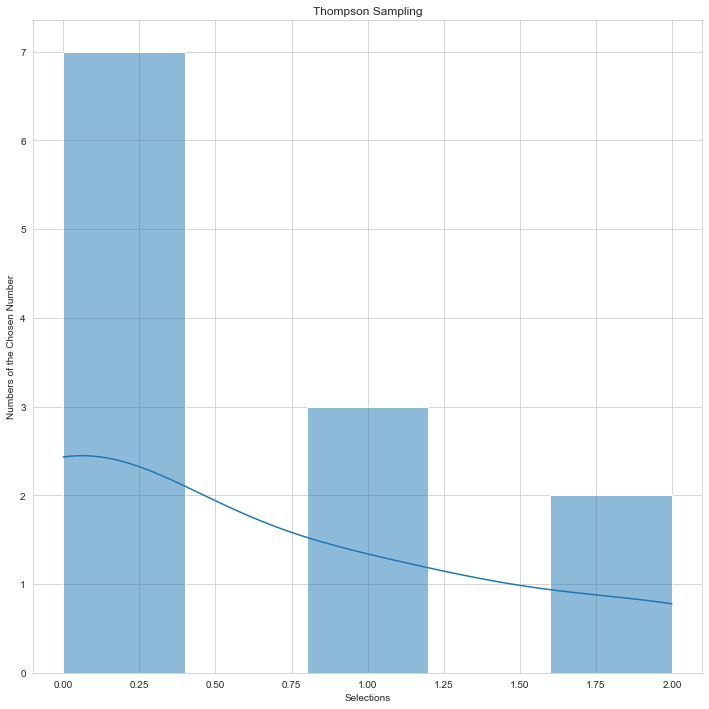

# Rock Paper Scissors with Thompson Sampling AI

## Problem Statement

The aim of this project is to achieve maximum success by the algorithm in the rock-paper-scissors game together with the **reinforcement (Thompson sampling) learning** method. The achievement of this success will be shaped by the preferences chosen by the user. At the end of each action, the rock, paper or scissors with the **highest beta value and the corresponding value were selected.** Compared to the bots that make a random choice, the ***artificial intelligence model and the integrated model have proven to be more successful*** in my own tests.

## Dataset

The dataset was **created automatically as a result of the values selected from the rock-paper-scissors options** selected by the user. There was no educational background in the background. The results and the dataset are completely personal.

## Methodology

In this project, as stated in the title, results were obtained through classifiaction method **Thompson sampling**. 

As seen in the formula:

1. First, N0(n) and N1(n) numbers were calculated for each action.

	**N0(n)** = The number of times 0 received as a reward so far.

	**N1(n)** = Number of times 1 received as a reward so far.

2. Secondly, a random number is generated in the beta distribution specified in the formula for each claim.

3. Finally, we took the value with the highest beta value. This value will indicate the option the algorithm will play against us.

The results were distributed on the histogram at the end of each operation, in other words, the tendency of the sampling was indicated. Thompson sampling was much more successful than randomly one.

You are free to visit [Thompson sampling](https://en.wikipedia.org/wiki/Thompson_sampling) website for learn the method better.

## Analysis

### Rock-Paper-Scissors DataFrame:

| Rounds | Rock | Paper | Scissor |
|--|--|--|--|
| 0 | 1 | 0 | 0 |
| 1 | 0 | 1 | 0 |
| 2 | 1 | 0 | 0 |
| 3 | 1 | 0 | 0 |
| 4 | 1 | 0 | 0 |
| 5 | 1 | 0 | 0 |
| 6 | 1 | 0 | 0 |
| 7 | 0 | 1 | 0 |
| 8 | 0 | 1 | 0 |
| 9 | 1 | 0 | 0 |
| 10 | 1 | 0 | 0 |
| 11 | 0 | 1 | 0 |

**Thompson Sampling Results**

Summation: **3** - Thompson sampling: **0**

**Loses: 5**

**Wins: 1**

**Draws: 6**

The histogram specified in ts_histogram.png shows the distribution of the last round. In line with the preferences, the algorithm obtained inferences from the user's preferences and only 1 win were obtained in 12 rounds. The system made a **random choice only in the first round.**

You can find detailed preferences and results in **console_ts.xml**.

**Random Selection Results**

**Loses: 1**

**Wins: 6**

**Draws: 5**

These results show only one of the obtained results. Many more virtual duels can be created and hypothesis tested through various loops. As can be understood, thompson sampling prevailed more.

## How to Run Code

Before running the code make sure that you have these libraries:

 - pandas 
 - matplotlib
 - seaborn
 - numpy
 - random
    
## Contact Me

If you have something to say to me please contact me: 

 - Twitter: [Doguilmak](https://twitter.com/Doguilmak) 
 - Mail address: doguilmak@gmail.com
 
